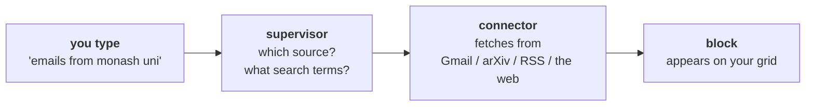

# latent

[](https://github.com/rid-saw/latent/actions/workflows/ci.yml)

**▶ [Try it live](https://rid-saw.github.io/latent)** in your browser, nothing to
install. Sample content; connect your own sources by running it locally.

A single, streamlined dashboard for everything you need to keep up with (news,
academic papers, YouTube, sports), pulled from the sources *you* connect and laid
out as adaptable content blocks.

[](https://rid-saw.github.io/latent)

## Idea

- **Adaptable blocks UI.** You choose what shows up. Describe an interest in plain
  English ("latest Fireship videos", "recent papers on AI in medicine"), and an
  agent finds, ranks, and populates a block with it. Drag, resize, rearrange.
- **Nothing to set up.** Papers, YouTube, news, sports, job listings (via Seek,
  AU/NZ roles) and general web search all read public sources. No API keys, no
  accounts. Connect Google only if you want your own inbox in there.
- **Your briefing.** Instead of ten tabs, one agent-written paragraph per page that
  summarizes what's new and worth your attention.
- **Your AI subscription, not an API bill.** All AI runs headless through the CLI
  of whichever provider you already use: Claude (Claude Code), ChatGPT (Codex
  CLI), or Gemini (Gemini CLI, free with a Google account). No API key, no
  per-token charges. (An Anthropic API key works as an optional fallback.)

## How it works

You type one sentence. Three steps run behind it.



**1. The supervisor decides where to look.** An LLM reads your request and returns
structured output: which source, what to actually search for, how many items, and
a short block title. *"emails from monash uni"* becomes source `gmail`, search
terms `from:monash.edu`, 3 items. Picking the terms is its own skill: Gmail
requires every word to match, so a casual "uni" finds nothing.

**2. A connector fetches.** Plain HTTP against free, keyless APIs wherever
possible (OpenAlex for papers, Google News RSS, ESPN, Seek, and YouTube's public
upload feeds). Only Gmail needs your own OAuth token, because only Gmail reads
something private.

Every step streams to the browser live over Server-Sent Events, so you watch the
agent decide instead of staring at a spinner.

### Three design decisions worth explaining

**There used to be a second agent, and measuring it is why there isn't.** A
critic read the fetched items, dropped the ones it judged off topic, and could
rewrite the search terms for another round. Instrumented over real blocks it
changed nothing visible, while costing an LLM call every time. It could only
delete, never reorder, so it could only affect a block by removing something
inside the first few items — and anything below that was trimmed away anyway.
To have any effect it needed the fetch to pull three times what the block
showed, and two guards existed purely to undo its mistakes. Deleting it took
all of that with it, halved the wait, and made the pipeline one call.


**The briefing is deliberately one LLM call.** An earlier version fanned out
(summarize each block, then combine), costing N+1 calls per briefing. On a
subscription metered by request rather than by token, that is the wrong shape. A
whole page is a few hundred short lines, comfortably inside a single call.

**No API key, by design.** `app/agents/llm.py` shells out to whichever provider
CLI you already have logged in and parses structured JSON back, so inference
bills to a subscription you are already paying for. Anyone who clones this gets
the full agentic version for free. The tradeoff is real: a CLI call takes about
20 seconds against roughly 2 for the API, there is no token streaming, and it
cannot scale to a multi-user server. For a single-user local app that trade is
worth making, and an API key still works as a fallback.

## Stack

| Layer     | Choice |
|-----------|--------|
| Frontend  | React 19 + Vite + TypeScript + Tailwind v4 |
| Blocks    | react-grid-layout (drag/resize) + zustand |
| Backend   | FastAPI (Python) + SQLite |
| Agents    | LangGraph: a supervisor routes the request, a connector fetches it |
| LLM       | **Your AI subscription**: Claude, ChatGPT, or Gemini via their CLIs, no API key |
| Auth      | Google OAuth, for Gmail only — nothing else needs an account |

## Structure

```
frontend/   React app (the dashboard + blocks)
backend/    FastAPI: integrations, agents, API
  app/integrations/   where content comes FROM (youtube, gmail, papers, news, espn, …)
  app/agents/         LangGraph agent pipeline + briefing
scripts/    dev helpers (scripts/dev.sh runs everything)
```

## Getting started

### 1. Install the tools

Four, plus one AI CLI. On macOS:

```sh
brew install node python uv     # runtimes + the Python package manager
npm install -g pnpm             # the Node package manager
```

Elsewhere: [Node 20+](https://nodejs.org), [Python 3.12+](https://python.org),
then

```sh
curl -LsSf https://astral.sh/uv/install.sh | sh   # uv
npm install -g pnpm                               # pnpm
```

Check they're all there:

```sh
node -v && pnpm -v && python3 -V && uv --version
```

<sub>**pnpm** is npm's job done differently. latent uses it because it blocks
package install scripts by default, which is the main way a compromised
dependency runs code on your machine. **uv** is the same idea for Python:
faster than pip, and it pins an exact dependency tree.</sub>

### 2. Sign in to an AI CLI

ONE of [Claude Code](https://claude.com/claude-code) (Claude subscription),
[Codex CLI](https://developers.openai.com/codex) (ChatGPT subscription), or
[Gemini CLI](https://github.com/google-gemini/gemini-cli) (free Google account).

Install it, then **run it once and log in** with the account you already have:

```sh
npm install -g @anthropic-ai/claude-code
claude          # opens a browser; log in, then quit with /exit
```

latent never sees that credential. It shells out to whichever CLI is on your
PATH and inherits the session. Skip this step and blocks still fill, but
routing falls back to keyword matching instead of the agent.

### 3. Run it

```sh
./scripts/dev.sh    # backend on :8000, frontend on :5173, Ctrl+C stops both
```

Open http://localhost:5173. Everything works immediately except Gmail,
which reads your own inbox and so needs your consent: copy `.env.example` to
`.env` (repo root) and follow [docs/oauth-setup.md](docs/oauth-setup.md).

## License

[PolyForm Noncommercial 1.0.0](LICENSE.md). You're welcome to clone this, run it,
learn from it, and modify it for personal or research use. Commercial use is not
permitted.

Required Notice: Copyright Riddhi Sawant (https://github.com/rid-saw/latent)
