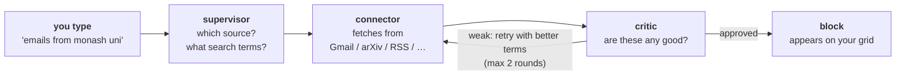

# latent

**▶ [Try it live](https://rid-saw.github.io/latent)** in your browser, nothing to
install. Sample content; connect your own sources by running it locally.

A single, streamlined dashboard for everything you need to keep up with (news,
academic papers, YouTube, sports), pulled from the sources *you* connect and laid
out as adaptable content blocks.

[](https://rid-saw.github.io/latent)

## Idea

- **Adaptable blocks UI.** You choose what shows up. Describe an interest in plain
  English ("latest Fireship videos", "recent papers on AI in medicine"), and an
  agent finds, ranks, and populates a block with it. Drag, resize, rearrange.
- **Bring your own sources.** Connect your Google account (YouTube + Gmail in one
  step). Papers, news, sports, and job listings (via Seek, AU/NZ roles) come from
  open sources, no API keys.
- **Your briefing.** Instead of ten tabs, one agent-written paragraph per page that
  summarizes what's new and worth your attention.
- **Your AI subscription, not an API bill.** All AI runs headless through the CLI
  of whichever provider you already use: Claude (Claude Code), ChatGPT (Codex
  CLI), or Gemini (Gemini CLI, free with a Google account). No API key, no
  per-token charges. (An Anthropic API key works as an optional fallback.)

## How it works

You type one sentence. Three steps run behind it.



**1. The supervisor decides where to look.** An LLM reads your request and returns
structured output: which source, what to actually search for, how many items, and
a short block title. *"emails from monash uni"* becomes source `gmail`, search
terms `from:monash.edu`, 3 items. Picking the terms is its own skill: Gmail
requires every word to match, so a casual "uni" finds nothing.

**2. A connector fetches.** Plain HTTP against free, keyless APIs wherever
possible (OpenAlex for papers, Google News RSS, ESPN, Seek). YouTube and Gmail go
through your own Google OAuth token.

**3. The critic checks the results.** A second LLM call reviews what came back and
drops anything off topic. If the whole set is weak, it rewrites the search terms
and the loop runs again, capped at two rounds so it cannot spin.

Two guard rails sit around that loop, because a self-correcting agent can make
things worse: a refinement returning fewer results than the round before it is
rejected and the previous set restored, and pruning can never leave a block with
fewer items than you asked for.

Every step streams to the browser live over Server-Sent Events, so you watch the
agent decide instead of staring at a spinner.

### Two design decisions worth explaining

**The briefing is deliberately one LLM call.** An earlier version fanned out
(summarize each block, then combine), costing N+1 calls per briefing. On a
subscription metered by request rather than by token, that is the wrong shape. A
whole page is a few hundred short lines, comfortably inside a single call.

**No API key, by design.** `app/agents/llm.py` shells out to whichever provider
CLI you already have logged in and parses structured JSON back, so inference
bills to a subscription you are already paying for. Anyone who clones this gets
the full agentic version for free. The tradeoff is real: a CLI call takes about
20 seconds against roughly 2 for the API, there is no token streaming, and it
cannot scale to a multi-user server. For a single-user local app that trade is
worth making, and an API key still works as a fallback.

## Stack

| Layer     | Choice |
|-----------|--------|
| Frontend  | React 19 + Vite + TypeScript + Tailwind v4 |
| Blocks    | react-grid-layout (drag/resize) + zustand |
| Backend   | FastAPI (Python) + SQLite |
| Agents    | LangGraph: supervisor routes → connectors fetch → critic verifies |
| LLM       | **Your AI subscription**: Claude, ChatGPT, or Gemini via their CLIs, no API key |
| Auth      | Google OAuth, one consent covers YouTube + Gmail |

## Structure

```
frontend/   React app (the dashboard + blocks)
backend/    FastAPI: integrations, agents, API
  app/integrations/   where content comes FROM (youtube, gmail, papers, news, espn, …)
  app/agents/         LangGraph agent pipeline + briefing
scripts/    dev helpers (scripts/dev.sh runs everything)
```

## Getting started

Prereqs: Node 20+, pnpm, Python 3.12+, uv, and ONE of these CLIs logged in:
[Claude Code](https://claude.com/claude-code) (Claude subscription),
[Codex CLI](https://developers.openai.com/codex) (ChatGPT subscription), or
[Gemini CLI](https://github.com/google-gemini/gemini-cli) (free Google account).

```sh
./scripts/dev.sh    # starts backend (:8000) + frontend (:5173), Ctrl+C stops both
```

First run: copy `.env.example` to `.env` (repo root) and add Google OAuth
credentials if you want YouTube/Gmail blocks (everything else works without).

## License

[PolyForm Noncommercial 1.0.0](LICENSE.md). You're welcome to clone this, run it,
learn from it, and modify it for personal or research use. Commercial use is not
permitted.

Required Notice: Copyright Riddhi Sawant (https://github.com/rid-saw/latent)
